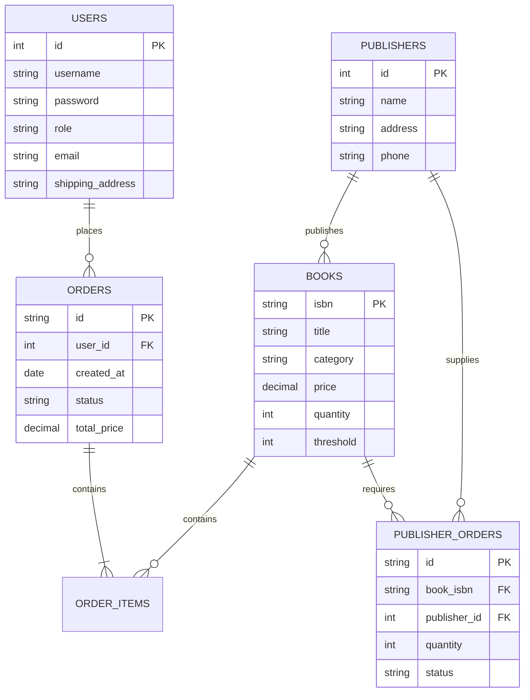

# Project Report: Order Processing System (Bookstore)

**Course:** Database Systems
**Program:** Computer and Communications (Fall 2025)

## 1. Group Members

1.  Mazen adel           - 8634
2.  Mazen Bassem         - 9021
3.  Ahmed Mahrous        - 8974
4.  Abdelrahman Mahgoub  - 9041
---

## 2. Implemented Features
We have successfully implemented a simplified online bookstore system that supports two user roles: **Administrators** and **Customers**.

### Core Features (Part 1)
*   **Book Management**: Admins can add new books (with thresholds) and update existing books (including stock).
*   **Stock Management**:
    *   **Automated Triggers**: The system automatically places replenishment orders from publishers when stock drops below a defined threshold.
    *   **Negative Stock Prevention**: Integrity constraints prevent stock from dropping below zero.
*   **Publisher Orders**: Admins can view and confirm pending orders from publishers to restock inventory.
*   **Advanced Search**: Users can search books by ISBN, title, author, category, or publisher.
*   **Reporting**: Admins have access to reports for:
    *   Monthly/Daily Sales.
    *   Top 5 Customers.
    *   Top 10 Selling Books.
    *   Replenishment order history.

### Customer Features (Part 2)
*   **User Accounts**: Secure Registration and Login.
*   **Profile Management**: Customers can edit their personal info (Name, Phone, Address) and change their password.
*   **Shopping Cart**: Full cart management (Add, Remove, Update Quantities, Calculate Totals).
*   **Checkout**: Simulation of credit card processing and immediate stock deduction.
*   **Order History**: Customers can view their past orders.

---

## 3. Entity Relationship Diagram (ERD)

---

## 4. Relational Schema
The database schema defines tables for Users, Books, Publishers, Orders, and replenishment workflows. It includes **Triggers** for automation and **Constraints** for data integrity.

### Tables
*   **Users**: `(id, username, password, email, first_name, last_name, role, phone, shipping_address)`
*   **Books**: `(isbn, title, authors, publisher, selling_price, category, quantity, threshold)`
*   **Publishers**: `(id, name, address, phone)`
*   **Orders**: `(id, user_id, status, total_price, created_at)`
*   **Order_Items**: `(id, order_id, book_isbn, quantity, price_at_purchase)`
*   **Publisher_Orders**: `(id, book_isbn, publisher_id, quantity, status)`

### Constraints & Triggers
1.  **Non-Negative Stock**: `CHECK (quantity >= 0)` on Books table.
2.  **Auto-Replenish Trigger**: Fires **AFTER UPDATE** on `books`. If `new_quantity < threshold`, creates a `Pending` order in `publisher_orders`.
3.  **Confirm Order Trigger**: Fires **AFTER UPDATE** on `publisher_orders`. If status becomes `Confirmed`, adds order quantity to `books` stock.

---

## 5. User Interface Logic

### Customer Screens
1.  **Registration/Login**: Validates credentials against the `users` table. On success, stores a token/session.
2.  **Home / Browse Books**: Displays book grid. Users can filter by Category sidebar or use the top Search Bar. Clicking "Add to Cart" interacts with the Cart Context.
3.  **Shopping Cart**: Lists selected items. "Checkout" button simulates payment validation (Card Length > 13) and commits the transaction, updating database stock.
4.  **Order History**: Fetches orders where `orders.user_id` matches the logged-in user.
5.  **Edit Profile**: Pre-fills a form with current user data. Submitting sends an update request to the `users` API.

### Admin Screens
1.  **Dashboard**: Overview of system health and quick links.
2.  **Book Management**: Table view of books. "Edit" opens a modal to adjust stock or changing thresholds.
3.  **Order Management**: Two tabs:
    *   *Customer Orders*: View status of sales.
    *   *Publisher Orders*: View low-stock alerts. Button to "Confirm" receipt of goods (triggers stock increase).
4.  **Reports**: Visual charts (or data tables) for Sales, Top Customers, and Top Books calculated from the `orders` and `order_items` history.
