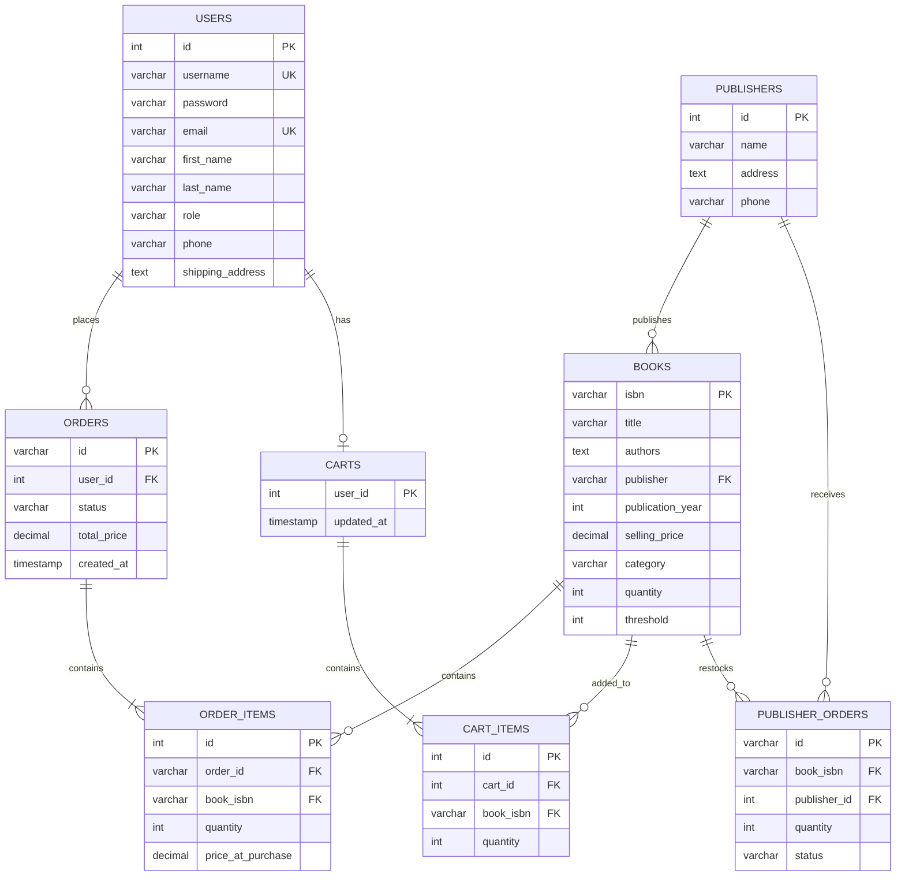

# Online Bookstore Order Processing System

**Course:** Database Systems  
**Program:** Computer and Communications Engineering (Fall 2025)

---

## Table of Contents

1. [Project Overview](#1-project-overview)
2. [Implemented Features](#2-implemented-features)
3. [Entity Relationship Diagram](#3-entity-relationship-diagram)
4. [Relational Schema](#4-relational-schema)
5. [Database Triggers](#5-database-triggers)
6. [Sample Data](#6-sample-data)
7. [User Interface Description](#7-user-interface-description)
8. [Technology Stack](#8-technology-stack)
9. [Installation & Usage](#9-installation--usage)
10. [Conclusion](#10-conclusion)

---

## 1. Project Overview

This is a full-stack online bookstore system that demonstrates database design principles including integrity constraints, triggers, and proper relational schema design. The system supports two user roles (Administrator and Customer) with distinct functionalities.

### System Architecture

```
┌─────────────────────────────────────────────────────────────┐
│                        FRONTEND                             │
│  ┌─────────────┐  ┌─────────────┐  ┌─────────────────────┐ │
│  │   Pages     │  │  Components │  │      Context        │ │
│  │  - Admin    │  │  - Navbar   │  │  - AuthContext      │ │
│  │  - Customer │  │  - BookCard │  │  - CartContext      │ │
│  │  - Auth     │  │  - Footer   │  │                     │ │
│  └──────┬──────┘  └─────────────┘  └──────────┬──────────┘ │
│         └──────────────┬───────────────────────┘            │
│                        ▼                                    │
│              ┌─────────────────┐                           │
│              │   Services/API  │                           │
│              └────────┬────────┘                           │
└───────────────────────┼─────────────────────────────────────┘
                        ▼
┌─────────────────────────────────────────────────────────────┐
│                      DATABASE                               │
│  ┌──────────┐ ┌──────────┐ ┌──────────┐ ┌───────────────┐  │
│  │  Users   │ │  Books   │ │Publishers│ │ Orders/Carts  │  │
│  └──────────┘ └──────────┘ └──────────┘ └───────────────┘  │
│                                                             │
│  Triggers: Auto-Replenish, Confirm-Stock-Update            │
└─────────────────────────────────────────────────────────────┘
```

---

## 2. Implemented Features

### 2.1 Administrator Features

| Feature | Description |
|---------|-------------|
| **Book Management** | Add, edit, delete books with ISBN, title, authors, publisher, price, category, stock, and threshold |
| **Stock Management** | Automated triggers for replenishment when stock drops below threshold |
| **Publisher Orders** | View, place, confirm, and cancel orders from publishers |
| **Reports** | Monthly/daily sales, top 5 customers, top 10 books, order history |
| **Dashboard** | System overview with alerts and quick actions |

### 2.2 Customer Features

| Feature | Description |
|---------|-------------|
| **Authentication** | Register, login, logout with session management |
| **Profile Management** | View and edit personal information |
| **Book Browsing** | Search, filter by category, sort by price/title/year |
| **Shopping Cart** | Add, update quantities, remove items with real-time totals |
| **Checkout** | Credit card payment simulation with stock validation |
| **Order History** | View past orders with detailed item breakdown |

---

## 3. Entity Relationship Diagram



### Relationship Summary

| Relationship | Cardinality | Description |
|-------------|-------------|-------------|
| USERS → ORDERS | 1:N | One user places many orders |
| USERS → CARTS | 1:1 | Each user has one cart |
| PUBLISHERS → BOOKS | 1:N | One publisher publishes many books |
| BOOKS → ORDER_ITEMS | 1:N | One book appears in many order items |
| BOOKS → PUBLISHER_ORDERS | 1:N | One book has many replenishment orders |
| ORDERS → ORDER_ITEMS | 1:N | One order contains multiple items |

---

## 4. Relational Schema

### 4.1 Table Definitions

**USERS**
```sql
CREATE TABLE users (
    id SERIAL PRIMARY KEY,
    username VARCHAR(50) UNIQUE NOT NULL,
    password VARCHAR(255) NOT NULL,
    email VARCHAR(100) UNIQUE NOT NULL,
    first_name VARCHAR(50),
    last_name VARCHAR(50),
    role VARCHAR(20) DEFAULT 'customer',
    phone VARCHAR(20),
    shipping_address TEXT,
    created_at TIMESTAMP DEFAULT CURRENT_TIMESTAMP
);
```

**BOOKS**
```sql
CREATE TABLE books (
    isbn VARCHAR(13) PRIMARY KEY,
    title VARCHAR(255) NOT NULL,
    authors TEXT[],
    publisher VARCHAR(100),
    publication_year INT,
    selling_price DECIMAL(10,2) NOT NULL,
    category VARCHAR(50),
    quantity INT DEFAULT 0 CHECK (quantity >= 0),
    threshold INT DEFAULT 5,
    image_url TEXT,
    created_at TIMESTAMP DEFAULT CURRENT_TIMESTAMP
);
```

**PUBLISHERS**
```sql
CREATE TABLE publishers (
    id SERIAL PRIMARY KEY,
    name VARCHAR(100) NOT NULL,
    address TEXT,
    phone VARCHAR(20)
);
```

**ORDERS**
```sql
CREATE TABLE orders (
    id VARCHAR(50) PRIMARY KEY,
    user_id INT REFERENCES users(id),
    status VARCHAR(20) DEFAULT 'pending',
    total_price DECIMAL(10,2),
    created_at TIMESTAMP DEFAULT CURRENT_TIMESTAMP
);
```

**ORDER_ITEMS**
```sql
CREATE TABLE order_items (
    id SERIAL PRIMARY KEY,
    order_id VARCHAR(50) REFERENCES orders(id),
    book_isbn VARCHAR(13) REFERENCES books(isbn),
    quantity INT NOT NULL,
    price_at_purchase DECIMAL(10,2) NOT NULL
);
```

**CARTS**
```sql
CREATE TABLE carts (
    user_id INT PRIMARY KEY REFERENCES users(id),
    updated_at TIMESTAMP DEFAULT CURRENT_TIMESTAMP
);
```

**CART_ITEMS**
```sql
CREATE TABLE cart_items (
    id SERIAL PRIMARY KEY,
    cart_id INT REFERENCES carts(user_id),
    book_isbn VARCHAR(13) REFERENCES books(isbn),
    quantity INT DEFAULT 1
);
```

**PUBLISHER_ORDERS**
```sql
CREATE TABLE publisher_orders (
    id VARCHAR(50) PRIMARY KEY,
    book_isbn VARCHAR(13) REFERENCES books(isbn),
    publisher_id INT REFERENCES publishers(id),
    quantity INT NOT NULL,
    order_date DATE DEFAULT CURRENT_DATE,
    status VARCHAR(20) DEFAULT 'Pending'
);
```

### 4.2 Integrity Constraints

| Type | Table.Column | Description |
|------|--------------|-------------|
| PRIMARY KEY | All tables | Unique identifier for each record |
| FOREIGN KEY | orders.user_id → users.id | Referential integrity |
| FOREIGN KEY | order_items.order_id → orders.id | Referential integrity |
| FOREIGN KEY | order_items.book_isbn → books.isbn | Referential integrity |
| FOREIGN KEY | publisher_orders.book_isbn → books.isbn | Referential integrity |
| UNIQUE | users.username | No duplicate usernames |
| UNIQUE | users.email | No duplicate emails |
| CHECK | books.quantity >= 0 | Non-negative stock |
| NOT NULL | Critical fields | Required data validation |

---

## 5. Database Triggers

### Trigger 1: Auto-Replenish Stock

**Purpose:** Automatically places a replenishment order when book stock falls below threshold.

```sql
CREATE OR REPLACE FUNCTION check_stock_threshold() RETURNS TRIGGER AS $$
BEGIN
    IF OLD.quantity >= OLD.threshold AND NEW.quantity < OLD.threshold THEN
        INSERT INTO publisher_orders (id, book_isbn, publisher_id, quantity, status)
        VALUES (
            'PO-' || CAST(extract(epoch from now()) as VARCHAR),
            NEW.isbn,
            (SELECT id FROM publishers WHERE name = NEW.publisher LIMIT 1),
            20,
            'Pending'
        );
    END IF;
    RETURN NEW;
END;
$$ LANGUAGE plpgsql;

CREATE TRIGGER trigger_auto_replenish
AFTER UPDATE ON books
FOR EACH ROW
EXECUTE FUNCTION check_stock_threshold();
```

### Trigger 2: Update Stock on Confirmation

**Purpose:** Automatically increases book stock when a publisher order is confirmed.

```sql
CREATE OR REPLACE FUNCTION update_stock_on_confirm() RETURNS TRIGGER AS $$
BEGIN
    IF NEW.status = 'Confirmed' AND OLD.status != 'Confirmed' THEN
        UPDATE books
        SET quantity = quantity + NEW.quantity
        WHERE isbn = NEW.book_isbn;
    END IF;
    RETURN NEW;
END;
$$ LANGUAGE plpgsql;

CREATE TRIGGER trigger_confirm_order
AFTER UPDATE ON publisher_orders
FOR EACH ROW
EXECUTE FUNCTION update_stock_on_confirm();
```

---

## 6. Sample Data

### 6.1 Books (10 items)

| ISBN | Title | Category | Price | Stock |
|------|-------|----------|-------|-------|
| 978-0-13-468599-1 | The Art of Computer Programming | Science | $89.99 | 25 |
| 978-0-06-112008-4 | To Kill a Mockingbird | Art | $14.99 | 50 |
| 978-0-19-953556-8 | A History of Modern Europe | History | $65.00 | 15 |
| 978-0-07-352332-7 | Physical Geography | Geography | $120.00 | 8 |
| 978-0-06-093546-7 | The Case for God | Religion | $27.95 | 30 |
| 978-1-59448-273-9 | A Short History of Nearly Everything | Science | $18.00 | 40 |
| 978-0-14-028329-7 | The Story of Art | Art | $39.95 | 22 |
| 978-0-06-083865-2 | Sapiens: A Brief History | History | $24.99 | 60 |
| 978-0-19-280722-2 | World Religions | Religion | $22.50 | 18 |
| 978-0-321-12521-7 | Introduction to Algorithms | Science | $95.00 | 3 |

### 6.2 Users (3 accounts)

| Username | Role | Email |
|----------|------|-------|
| admin | Administrator | admin@bookstore.com |
| john_doe | Customer | john@example.com |
| jane_smith | Customer | jane@example.com |

### 6.3 Publishers (10 publishers)

Addison-Wesley, HarperCollins, W.W. Norton, Wiley, Knopf, Broadway Books, Phaidon Press, Harper, Oxford University Press, MIT Press

---

## 7. User Interface Description

### 7.1 Authentication

| Screen | Purpose | Key Functions |
|--------|---------|---------------|
| Login | User authentication | Validate credentials, redirect by role |
| Register | Account creation | Validate unique username/email, create account |

### 7.2 Customer Screens

| Screen | Purpose | Key Functions |
|--------|---------|---------------|
| Home | Landing page | Welcome message, navigation |
| Browse Books | Catalog view | Search, filter, sort, add to cart |
| Cart | Order preparation | Update quantities, remove items, checkout |
| Order History | Purchase records | View past orders with details |
| Profile | Account info | View/edit personal information |

### 7.3 Administrator Screens

| Screen | Purpose | Key Functions |
|--------|---------|---------------|
| Dashboard | System overview | Stats, alerts, quick actions |
| Book Management | Inventory CRUD | Add, edit, delete, adjust stock |
| Order Management | Publisher orders | Place, confirm, cancel orders |
| Reports | Business analytics | Sales reports, top customers/books |

---

## 8. Technology Stack

| Layer | Technology |
|-------|------------|
| Frontend | React 18 + TypeScript |
| Build Tool | Vite |
| Styling | Bootstrap 5 |
| Routing | React Router v6 |
| State | React Context API |
| Icons | React Icons |
| Backend | Express.js |
| Database | PostgreSQL |

---

## 9. Installation & Usage

### Prerequisites
- Node.js 18+
- npm

### Quick Start

```bash
# Clone repository
git clone https://github.com/ENMazenAdel/bookstoredb.git
cd bookstoredb

# Install and run frontend
cd frontend
npm install
npm run dev
```

### Demo Credentials

| Role | Username | Password |
|------|----------|----------|
| Admin | admin | admin |
| Customer | john_doe | password |

### Live Demo
🔗 https://enmazenadel.github.io/bookstoredb/

---

## 10. Conclusion

This project successfully implements a complete bookstore order processing system demonstrating:

- ✅ **Integrity Constraints**: Primary keys, foreign keys, unique constraints, check constraints
- ✅ **Database Triggers**: Auto-replenishment and stock update automation
- ✅ **Complete CRUD Operations**: Full book and user management
- ✅ **Shopping Workflow**: Cart management and checkout process
- ✅ **Reporting System**: Sales analytics and business insights
- ✅ **Role-Based Access**: Separate admin and customer interfaces
- ✅ **Sufficient Sample Data**: 10 books, 10 publishers, 3 users with transaction history

The system provides a practical demonstration of database design principles in a real-world e-commerce context.
